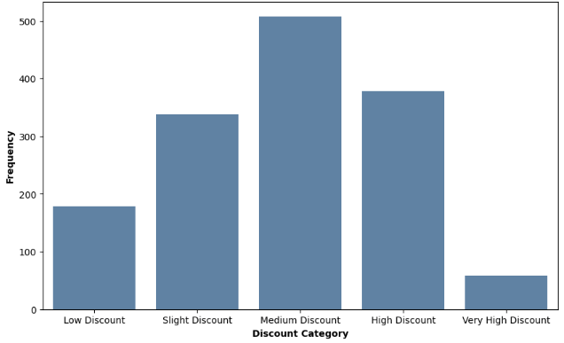
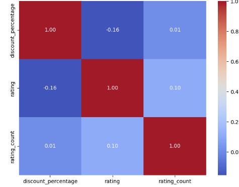
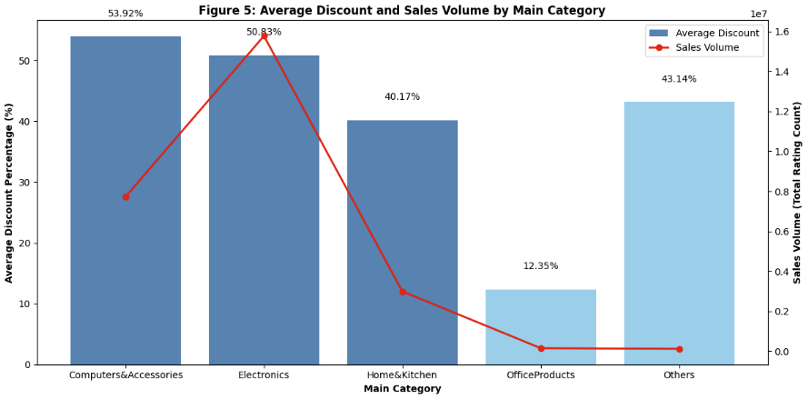
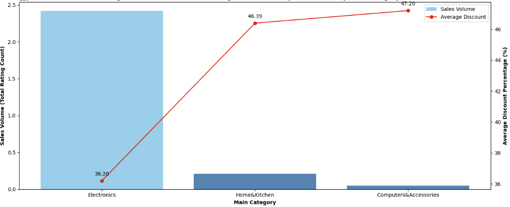
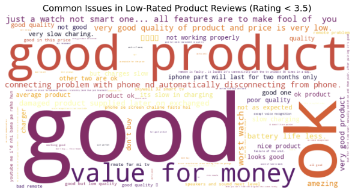

# 📊 Amazon Discount Strategy Report

## 📝 Overview

This project analyzes Amazon’s discount strategies across various product categories, focusing on how discounts impact **sales volume**, **customer ratings**, and **purchase behavior**. Despite assumptions, deeper discounts don’t always lead to higher satisfaction or more sales — and sometimes, they’re not effective at all.

---

## 🧠 Key Insights

### 📈 Discounts Distribution

- The majority of discounts fall in the 40%–60% range, where they appear to be most effective at boosting sales.

- Discounts below 40% and above 60% are far less frequent, indicating that:

 - Small discounts may be insufficient to motivate buyers.

 - Large discounts might be rare due to profit concerns or may fail to increase sales in some categories.

- This pattern suggests that mid-range discounts strike the best balance between attracting customers and maintaining margins.

---

### 🎯 Correlaion Matrix

- Weak correlation between discount % and customer ratings (r = -0.16).
- Regression plots:
  - Discount vs. Rating: R² = 0.0242
  - Discount vs. Rating Count: R² = 0.0001
- Customers care more about **product quality** than discounts.

> 📌 Office Products scored the **highest rating (4.31)** despite the **lowest discount (12.35%)**.

---

### 💸 Discount vs Sales Volume 

- **Electronics & Computers**: High discounts (50%+) = high sales → effective use of discounting.
- **Home & Kitchen**: Moderate discounts = moderate sales → influenced by utility, design, or presentation.
- **Office Products & Others**: High/low discounts, still low sales → discounts don’t drive demand here.

---

### ⭐ Average Discount vs Customer Rating 

- **Office Products**: Highest average rating (4.31) with minimal discount → quality wins over price.
- **Electronics & Computers**: Heavy discounts (>50%) but only moderate ratings (~4.1) → discounts ≠ satisfaction.
- **Low-rated items** often receive deep discounts → signals quality or expectation issues not solved by price drops.

---

## 🔎 High-Ticket Item Trends

- **Electronics**: Lowest discount (36%) but highest sales → strong natural demand.
- **Computers & Accessories**: Deep discounts (47.7%) yet lowest sales → brand loyalty or saturation may be factors.
- **Home & Kitchen**: High discounts but weak sales → discounts ineffective for high-end home goods.

---

## 🗣️ Customer Feedback Word Cloud

- Common issues: “not working,” “battery,” “slow,” and “connectivity” — especially in tech products.

- Terms like “value for money” and “not as expected” suggest a gap between expectation and reality.

- Mixed words like “good” and “ok” show partial satisfaction, but deeper quality concerns remain.

📌 Discounts don’t solve product flaws — focus on quality and clear descriptions.

---

## 📌 Recommendations

- Improve **product quality** and **description accuracy** to match customer expectations.
- Use **targeted, seasonal discounts** in high-performing categories like Electronics.
- Rethink strategy for weak categories: try **bundling**, **loyalty perks**, or **better segmentation** instead of markdowns.

---

## 🔗 Project Notebook

Explore the full code and visualizations here:  
📎 [Google Colab Link](https://colab.research.google.com/drive/1H342Q9YWWokiJxCHR9qghHDJoWz54uyN#scrollTo=scFMA_8hfld6)

---

## 👋 Contact
For questions or feedback, please reach out to tonyle2814@gmail.com

